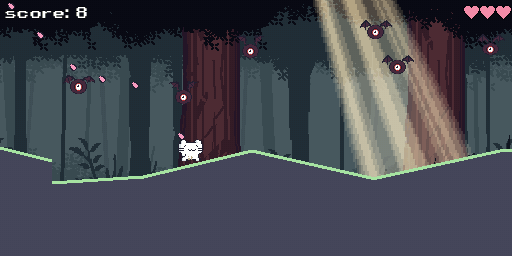
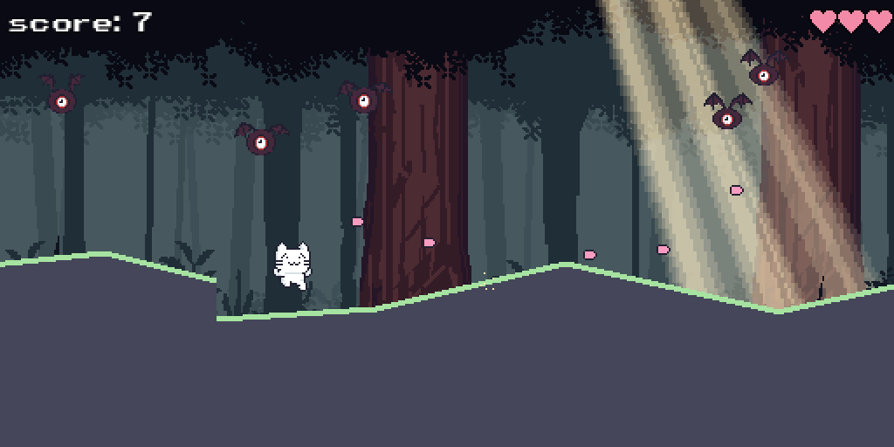
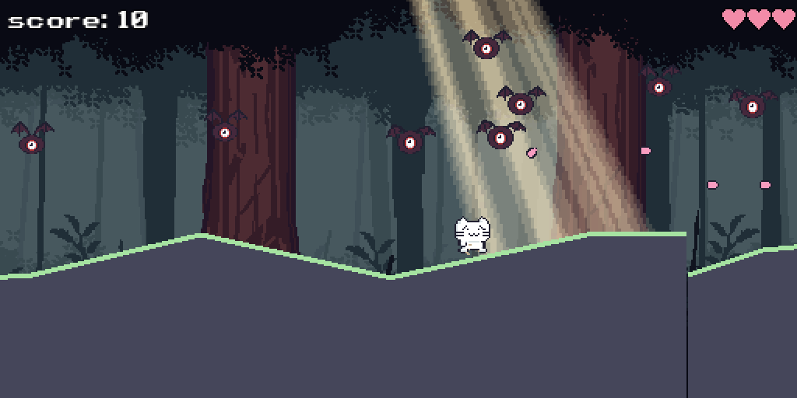

# Kitty Run Redux

An endless runner shoot-em-up made with Godot 4. Run, double-jump, and stomp your way through an infinite forest while shooting down one-eyed bats before they shoot you.

**[Play in your browser on itch.io](https://grumpyrumpus.itch.io/kitty-run-redux)**



A ground-up Godot remake of [runner](https://github.com/Hugh-ONeill/runner), my original Pygame version of the same idea.

## Features

- Infinite scrolling terrain with pits, height variation, and a parallax forest backdrop
- Enemy AI with distinct flight patterns (flap, swoop, spiral) and projectile attacks
- Stomp kills, Mario style: bounce off enemy heads to chain aerial kills
- Combo system: kills within the combo window stack a score multiplier
- Powerup drops with a smart loot pool that never gives you what you already have: shield, rapid fire, giant bullets, extra jumps, health
- Difficulty that ramps two ways: spawn rate scales with score, scroll speed scales with time
- Game feel throughout: hitstop, screen shake, squash and stretch, camera punch, coyote time, jump buffering, variable jump height, invincibility frames
- CRT shader toggle, rebindable keys, persistent settings and high score
- First-run tutorial hints and a pixel-dissolve game over transition

## Controls

| Action | Input |
|---|---|
| Move | A / D or arrow keys |
| Jump, double jump | W or Up |
| Sprint | Shift |
| Aim and shoot at cursor | Hold left click |
| Keyboard aim and shoot | I / J / K / L, diagonals U / O |
| Fire in last aim direction | Space |
| Pause | Esc |

All keys are rebindable in the options menu.

## Screenshots

| | |
|---|---|
|  |  |

## How it's built

- **Godot 4.6 / GDScript.** Scripts are heavily commented and written to be readable as a reference.
- **State machine player controller.** Each movement state (standing, running, jumping, falling, hurting, dead) is its own node under `scripts/state_machine/`, with transitions returned from input/physics handlers.
- **Signal-driven game feel.** The player broadcasts events (`stomped`, `shot_fired`, `health_changed`) and the game controller routes them to screen shake, hitstop, camera punch, and the combo system. The player knows nothing about scoring or UI.
- **Autoload singletons** for settings, high score, and music, so they survive scene changes.
- **Continuous deployment.** Every push to `main` exports the web build via GitHub Actions and publishes it to itch.io with butler.

Development notes live in [TODO.md](TODO.md) (feature backlog) and [BUGS.md](BUGS.md) (root-cause postmortems of the more interesting bugs, like Godot's viewport-stretch mouse coordinate mismatch).

## Running locally

Requires Godot 4.6 or later. Open the project in the editor, or run it directly:

```sh
godot --path . res://game.tscn
```

## Credits

Music and shaders are CC0 works by their respective authors; see [CREDITS](CREDITS) for the full list. Everything else by GrumpyRumpus.
